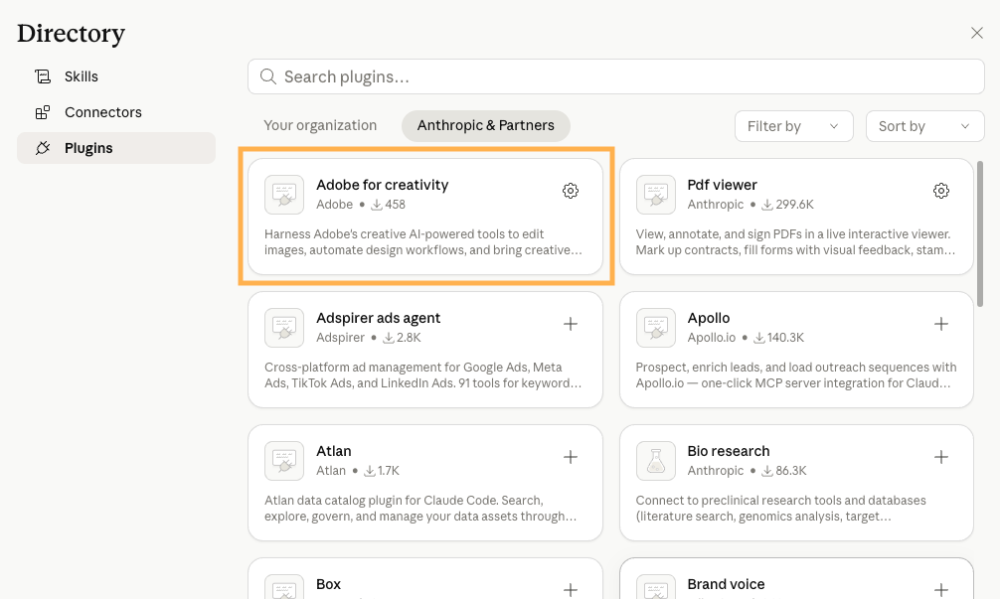
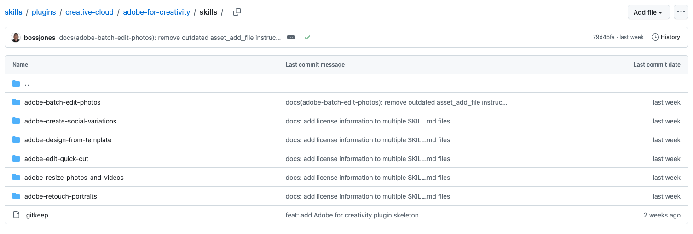

# Getting started

This page covers everything you need to set up and start using Adobe for creativity in Claude — whether you're using Claude chat, Claude Desktop, or Cowork.

## What you need to get started

* A Claude account (Free, Pro, Max, Team, or Enterprise). Some features require a paid plan — see [Technical requirements](#technical-requirements) for details.
* An Adobe account for full functionality, higher limits, and saved work across sessions.

## Connector, Plugin & Skills

### Connector

The connector links Claude to Adobe's creative tools. Set it up once, and Claude can access and use those tools within your conversations.

[Use this link](https://claude.ai/directory/connectors/adobe-creativity) to connect directly or follow these instructions:

* Open **Claude** at claude.ai (or Claude Desktop) and sign in.
* In the left sidebar, click **Customize**.
* Select the **Connectors** tab, then click the + button.
* Click **Browse connectors**.
* Search for **Adobe for creativity** and click it.
* Click **Install** and confirm the connection.
* Sign in with your Adobe account to unlock higher usage limits, more tools, and work that saves across sessions. (You can skip this step and continue as a guest, but with reduced capabilities)

### Plugin

The plugin extends Claude with a bundled set of tools and skills tailored to a specific creative workflow. Install it once, and Claude gains new capabilities available across your conversations.

[Use this link](https://claude.ai/directory/plugins/adobe-for-creativity%40knowledge-work-plugins) to install directly or follow these instructions:

* Open *Claude* at Claude Desktop and sign in.
* In the left sidebar, click Customize.
* Click Browse plugins.
* Search for the plugin by name (Adobe for creativity) and click it.
* Click Install.

Certain skills require authentication (e.g. log in with your Adobe ID), follow the prompts to complete setup. You can sometimes skip this and use the plugin with limited functionality.

*Note: Only users with access to paid Claude plans would be able to install Plugins. Plugins ensure users have the latest update of the skills.*

### Skills (Optional)

If you are not able to use plugins, you can directly load Adobe skills into Claude. Skills guide how those tools are used for specific tasks. Think of them as ready-made workflows, like portrait retouching or designing from templates, with the right steps already built in.

Skills are available on GitHub. Download the skill files, then add them to Claude:

* Go to the Adobe skills [repository on GitHub](https://github.com/adobe/skills/tree/main/plugins/creative-cloud/adobe-for-creativity/skills).
* Download the skill file(s) you want to use.
* Open Claude and go to **Customize**.
* Select **Skills**.
* Click **Create skill** -> **Upload a skill** and upload the file.
* Confirm to install.

### How they work together

Once added, the connector, plugin, and skills are all available in your chats and work together to guide Claude through your creative workflows.

The connector is the foundation — it links Claude to Adobe's tools and unlocks creative capabilities on its own. Skills take it further by using the right tools to deliver results tailored to your workflow, making Claude noticeably better at specific creative tasks. The plugin brings everything together in one install: it bundles a curated set of skills alongside the connector, so you get a complete, ready-to-use workflow without setting up each piece separately.

*Note: Connectors and skills can't be browsed or installed from the iOS or Android apps. Set up on the web or desktop first, then use the mobile apps to run the workflows you've installed.*

## Technical requirements

System and platform requirements for using Adobe for creativity in Claude.

### Where it works

| Platform | Supported |
| --- | --- |
| Claude on the web (claude.ai) | ✅ |
| Claude Desktop (macOS, Windows) | ✅ |
| Cowork (macOS, Windows) | ✅ — paid Claude plans only |
| Claude iOS app or Android app | ⚠️ Run existing workflows only. New connectors, skills, and plugins can't be installed from mobile — set up on web or desktop first. |

### Adobe account requirements

An Adobe account is optional but recommended.

Guest users can use free tools included in this MCP right away (about ~40 standard tools), directly in chat. 
Sign in with a free or paid Adobe account when you want more tools, Creative Cloud storage for your assets, and higher usage limits, and continuity across sessions.

**Team and Enterprise setup:** An enterprise admin must enable 3P Connectors under Organization settings → Skills before members can use the full experience. Owners can also provision the connector and recommended skills organization-wide.

### Browser support

* macOS: Google Chrome version 143 and later; 
* Windows: Google Chrome version 143 and later; Microsoft Edge version 143 and later

### Operating system

| OS | Minimum version |
| --- | --- |
| macOS | 18.2 and later |
| Windows | Windows 10 and later |

### Hardware

* **Processor:** 64-bit processor with 4 or more cores
* **Internet:** A stable internet connection is required. Large uploads and video work benefit from faster connections.

## What's next?

* Explore the [Prompts and Workflows](../prompts-and-workflows/index.md) for workflow-specific examples.
* Hit a problem? See [FAQ & support](../support/index.md).
