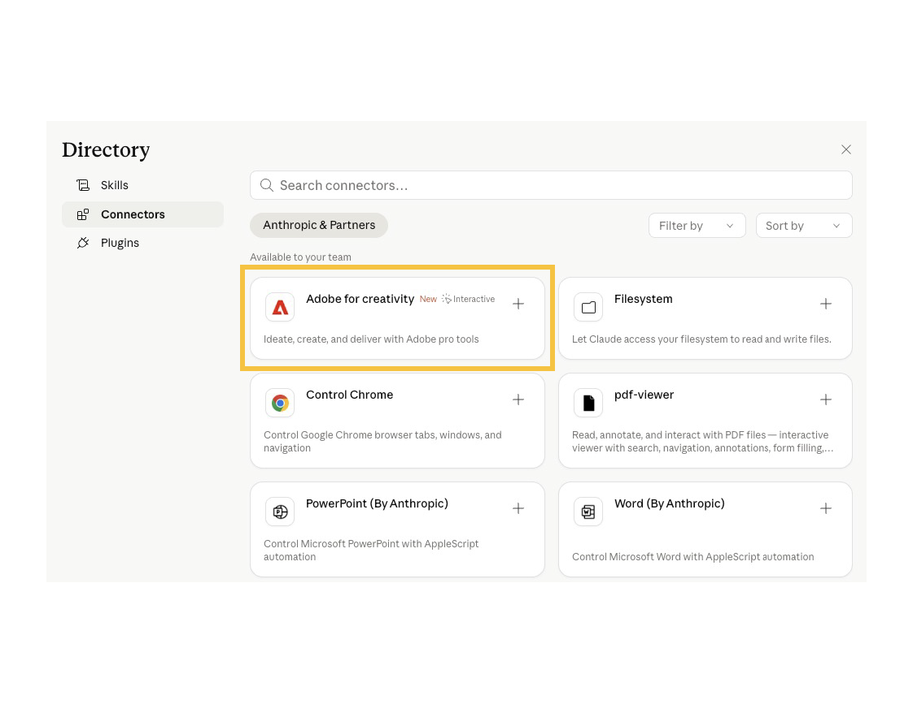

# Getting started

This page covers everything you need to set up and start using Adobe for creativity in Claude — whether you're using Claude chat, Claude Desktop, or Cowork.

**Jump to:**

* [What you need to get started](#what-you-need-to-get-started)
* [Connector vs. Skills](#connector-vs-skills)
* [Set up in Claude chat (web and Claude Desktop)](#set-up-in-claude-chat)
* [Set up in Cowork (desktop app, paid plans)](#set-up-in-cowork)
* [Technical requirements](#technical-requirements)

## What you need to get started

* A Claude account (Free, Pro, Max, Team, or Enterprise). Some features require a paid plan — see [Technical requirements](#technical-requirements) for details.
* An Adobe account for full functionality, higher limits, and saved work across sessions.
* Code execution and file creation enabled in Claude (required for skills):
  * Free, Pro, Max: Settings → Capabilities.
  * Team, Enterprise: An admin must enable Code execution, file creation, and Skills at the organization level.

## Connector vs. Skills

What's the difference and how to set them up

To get the full experience, you'll set up two things:

<Columns slots="image, heading, text" repeat="3" isReversed="true" />

### Connector

The connector links Claude to Adobe's creative tools. Set it up once, and Claude can access and use those tools within your conversations.

[Use this link](https://claude.ai/directory/connectors/adobe-creativity) to connect directly or follow these instructions:

* Open **Claude** at claude.ai (or Claude Desktop) and sign in.
* In the left sidebar, click **Customize**.
* Select the **Connectors** tab, then click the + button.
* Click **Browse connectors**.
* Search for **Adobe for creativity** and click it.
* Click **Install** and confirm the connection.
* Sign in with your Adobe account to unlock higher usage limits, more tools, and work that saves across sessions. (You can skip this step and continue as a guest, but with reduced capabilities — see [Access details](../index.md#access-details).)

### Skills

Skills guide how those tools are used for specific tasks. Think of them as ready-made workflows, like portrait retouching or designing from templates, with the right steps already built in.

Skills are available on GitHub. Download the skill files, then add them to Claude:

* Go to the Adobe skills [repository on GitHub](https://github.com/adobe/skills/tree/main/plugins/creative-cloud/adobe-for-creativity/skills).
* Download the skill file(s) you want to use.
* Open Claude and go to **Customize**.
* Select **Skills**.
* Click **Add skill** and upload the file.
* Confirm to install.

Once added, the connector and skills are available to use in your chats and will guide Claude through your workflows.

### Plugin

To be updated

[button 3](https://example.com)

### How they work together

Once added, the connector and skills are available to use in your chats and will guide Claude through your workflows. 
 
The connector gives you access and unlocks powerful capabilities on its own. Skills take it further by using the right tools to deliver results tailored to your workflow, making Claude noticeably better at specific creative tasks. 

*Note: Connectors and skills can't be browsed or installed from the iOS or Android apps. Set up on the web or desktop first, then use the mobile apps to run the workflows you've installed.*

## Set up in Claude chat

Best for: quick conversational edits, one-off generations, fast iteration on a single asset. Works on [claude.ai](https://claude.ai/), Claude Desktop, and (for running already-installed workflows) the mobile apps.

Time to set up: ~3 minutes.

### Step 1: Install the connector

1. Open **Claude** at [claude.ai](https://claude.ai/) (or Claude Desktop) and sign in.
2. In the left sidebar, click **Customize**.
3. Select the **Connectors** tab, then click the + button.
4. Click **Browse connectors**.
5. Search for **Adobe for creativity** and click it.
6. Click **Install** and confirm the connection.
7. Sign in with your Adobe account to unlock higher usage limits, more tools, and work that saves across sessions. (You can skip this step and continue as a guest, but with reduced capabilities — see [Access details](../index.md#access-details).)

You'll see a confirmation when the connector is active. It's now available in every new chat.

#### Enable the connector for a specific chat

By default, the connector is available anytime. If you've added many connectors, you can turn individual ones on or off per conversation:

1. In any chat, click the + button in the lower-left of the message box (or type `/`).
2. Hover over **Connectors**.
3. Toggle **Adobe for creativity on.**

### Step 2: Add creative skills

The connector gives Claude access to Adobe tools. Skills teach Claude how to use those tools well for specific kinds of work. We strongly recommend installing the skills that match the creative work you do most.

#### Enable skills in your settings

Before skills can run, make sure **Code execution and file creation** is enabled:

* **Free, Pro, Max:** Settings → Capabilities → Code execution and file creation.
* **Team, Enterprise:** An owner must enable both Code execution and file creation and Skills under Organization settings → Skills before members can use them.

#### The Adobe skills

Six skills ship alongside the connector, each built around a common creative workflow:

| Skill | What it does |
| --- | --- |
| `adobe-batch-edit-photos` | Apply consistent edits — exposure, color, straightening, cropping — across a batch of photos in one pass. |
| `adobe-create-social-variations` | Design multiple on-brand variations of a social post from a single source asset. |
| `adobe-design-from-template` | Build new designs from a template, auto-filling your brand colors, fonts, and content. |
| `adobe-edit-quick-cut` | Trim, reorder, and quick-cut video into short highlight or teaser clips. |
| `adobe-resize-photos-and-videos` | Reformat photos and videos for specific platforms and aspect ratios with smart cropping. |
| `adobe-retouch-portraits` | Retouch portraits — skin, eyes, color balance — while keeping natural texture. |

#### Install the skills

[Placeholder — please confirm the right instructions for your users. Two possibilities:]

**Option A — if the skills are bundled with the connector:** Once the Adobe for creativity connector is installed, its skills are available automatically. No separate install needed. You can view and toggle them under Customize → Skills.

**Option B — if users install skills individually from the Skills directory:**

1. In the left sidebar, click **Customize**.
2. Select the **Skills** tab, then click the + button.
3. Click **Browse skills**.
4. Search for `adobe-` to see all six skills.
5. Click **Install** on each skill you want. Skills are enabled by default once installed — you can toggle them off anytime from Customize → Skills.

The skills are open source and hosted at [github.com/adobe/skills](https://github.com/adobe/skills/tree/main/plugins/creative-cloud/adobe-for-creativity/skills). You can inspect, fork, or adapt them for your own workflows.

Skills activate automatically when a task matches. You don't have to name them in your prompt, but you can reference them explicitly (for example, "use adobe-retouch-portraits on these headshots") to be sure Claude uses the right one.

### Step 3: Run your first prompt

Start a new chat and try one of these:

`"Remove the background from this photo and give me a version with a soft shadow." (attach a JPEG or PNG)`

`"Make an Instagram story promoting a weekend sale at my bakery. Use warm colors and include the text 'Weekend treats — 20% off'."`

`"Search Adobe Stock for free landscape photos of mountains at golden hour. Show me six options."`

Claude will ask the connector to do the work, and in many cases render the result directly in the chat. You can iterate from there — `"make it brighter,"` `"try a different font,"` and so on.

#### Tips for better results in chat

* **Attach high-resolution source files.** The connector works with what you give it.
* **Be specific about output.** Dimensions, aspect ratio, file type, and platform help a lot.
* **Iterate conversationally.** Chat's strength is fast back-and-forth — start rough and refine.
* **Sign in to Adobe to save work across sessions.** Guest edits are not persisted.

## Set up in Cowork

Cowork is Claude's desktop workspace for extended, multi-step projects. It's the best fit for creative work that spans multiple files, combines Adobe with other tools (Drive, Slack, Figma), or needs a repeatable setup you tune to your own process.

In Cowork, you get access to **plugins** — packages that bundle the Adobe connector, the right skills, and ready-made slash commands together, so you don't have to install each piece separately.

**Time to set up:** ~5 minutes. **Requires:** A paid Claude plan (Pro, Max, Team, or Enterprise) on macOS or Windows.

📹 Watch: Cowork setup for creatives — [embed 3-minute Cowork walkthrough]

### Step 1: Install the Adobe for creativity plugin

The plugin is the recommended way to use Adobe in Cowork. It installs the connector, bundled skills, and slash commands in one step.

1. Open **Claude Desktop** and switch to the **Cowork** tab.
2. In the left sidebar, click **Customize**.
3. Select the **Plugins** tab, then click the + button.
4. Click **Browse plugins.**
5. Search for **Adobe for creativity** and click **Install.**
6. Sign in to your Adobe account when prompted.

Once installed, the plugin activates automatically. Skills fire when relevant, and slash commands appear when you type / in the chat.

#### Prefer to install components individually?

You don't have to use the plugin. You can add the connector and skills separately:

* **Connector only:** Customize → Connectors → + → Browse connectors → Adobe for creativity → Connect.
* **Skills only:** Customize → Skills → + → Browse skills → search "Adobe" → Install.

We recommend the plugin for most users because it keeps the pieces in sync and exposes slash commands that shortcut common workflows.

### Step 2: Use the skills and slash commands

The plugin ships with six skills that cover the most common creative workflows:

* `adobe-batch-edit-photos` — consistent edits across a batch
* `adobe-create-social-variations` — multiple on-brand social variations from one asset
* `adobe-design-from-template` — designs built from a template with your brand
* `adobe-edit-quick-cut` — short video cuts and highlights
* `adobe-resize-photos-and-videos` — platform-specific reformats with smart cropping
* `adobe-retouch-portraits` — portrait retouching that keeps natural texture

Skills fire automatically when you describe a matching task. You can also invoke them explicitly by typing `/` in the chat and picking the one you want — Cowork may present a short form for inputs (target aspect ratio, output folder, brand) before running.

[Placeholder: confirm which skills expose as slash commands in Cowork vs. trigger only by prompt.]

### Step 3: Work with local files

One of Cowork's biggest advantages is direct access to files on your computer.

* **Drag and drop** files from Finder or File Explorer into the chat.
* **Reference folders** — "process every JPEG in ~/Desktop/Shoot-04-18 and save the retouched versions to ~/Desktop/Shoot-04-18/final."
* **Combine with other connectors** — "grab the brief from the Google Drive folder I shared with the design team, then generate three poster options based on it."

Cowork will ask permission the first time it accesses a folder.

## Technical requirements

System and platform requirements for using Adobe for creativity in Claude.

### Where it works

| Platform | Supported |
| --- | --- |
| Claude on the web (claude.ai) | ✅ |
| Claude Desktop (macOS, Windows) | ✅ |
| Cowork (macOS, Windows) | ✅ — paid Claude plans only |
| Claude iOS app | ⚠️ Run existing workflows only. New connectors, skills, and plugins can't be installed from mobile — set up on web or desktop first. |
| Claude Android app | ⚠️ Same as iOS. |

### Claude plan requirements

| Feature | Plan |
| --- | --- |
| Install the connector | Any Claude plan (Free, Pro, Max, Team, Enterprise) |
| Use skills with the connector | Any plan, but Code execution and file creation must be enabled |
| Use the Cowork plugin | Paid plans only (Pro, Max, Team, Enterprise) |

**Team and Enterprise setup:** An owner must enable both Code execution and file creation and Skills under Organization settings → Skills before members can use the full experience. Owners can also provision the connector and recommended skills organization-wide.

### Adobe account requirements

An Adobe account is optional but recommended. See [Access details](../index.md#access-details) for what each level unlocks.

* **Guest:** No Adobe sign-in. Limited tool set, no persistent storage.
* **Free Adobe ID:** Access to more tools; assets saved to your free Adobe storage.
* **Paid subscription** (Creative Cloud, Firefly, Adobe Stock, etc.): Full tool set; assets saved to your Creative Cloud Files; generative credits and Stock licensing follow your Adobe plan.

### Browser support

We recommend the latest version of a supported browser.

#### macOS

* Google Chrome 143 or later
* Apple Safari 26 or later

#### Windows

* Google Chrome 143 or later
* Microsoft Edge 143 or later

#### ChromeOS (Chromebook)

* Google Chrome 143 or later

Firefox is not officially supported at this time.

### Operating system

| OS | Minimum version |
| --- | --- |
| macOS | 18.2 |
| Windows | Windows 10 |
| ChromeOS | Latest stable |

### Hardware

* **Processor:** 64-bit, 4 or more cores
* **Memory:** 8 GB RAM minimum (16 GB recommended for video workflows)
* **Storage:** Enough free space for the assets you upload and receive
* **Internet:** Stable broadband connection required. Large uploads and video work benefit from faster connections.

### Language and regional availability

* **Interface language:** The connector follows your Claude interface language.
* **Prompt languages:** You can prompt Claude in any language Claude supports — Adobe tools will execute regardless of the prompt language, though text generation and font suggestions work best in English at this time.
* **Regions:** Available in the same regions as Claude and Adobe Creative Cloud.

Files processed through the connector follow the data handling terms outlined in the [FAQ](../support/index.md#privacy-and-data).

## What's next?

* Explore the [prompt library](../prompts-and-workflows/index.md) for workflow-specific examples.
* Hit a problem? See [FAQ & support](../support/index.md).
