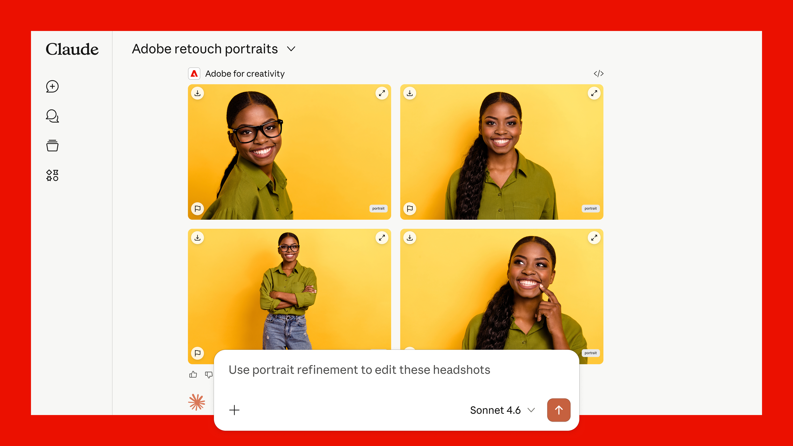
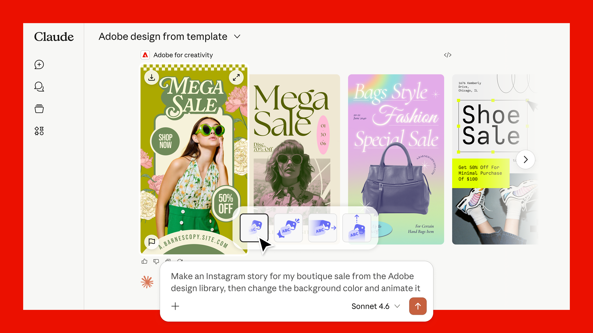
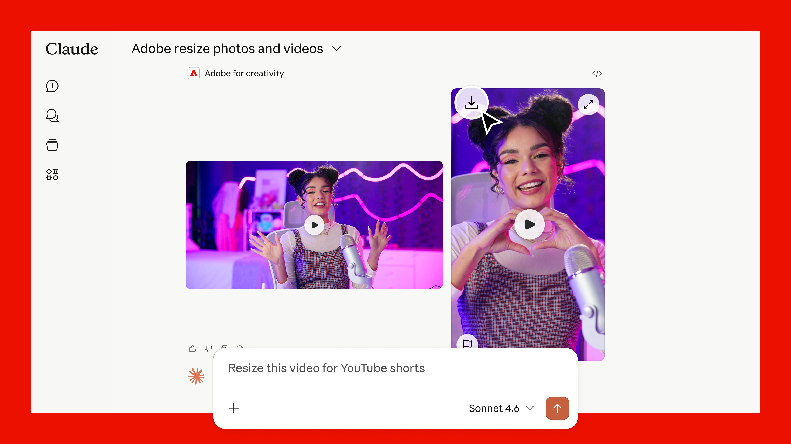

<Superhero slots="fullWidthBackground, video, heading, text, buttons" variant="halfWidth" textColor="white" overGradient />

[video_url](./assets/social variation.mp4)

# Adobe for creativity available in Claude

Adobe for creativity brings capabilities across the creative cloud into a unified, creative connector. Access 50+ tools across Photoshop, Lightroom, Illustrator, Firefly, Premiere, Express, InDesign, and Adobe Stock — all through natural language, without switching apps. Describe what you want to achieve, from editing photos and vectors to designing assets and formatting video. Sign in with your Adobe account for higher usage limits, more tools, and cross-session continuity.

* [Try it in Claude](https://claude.ai/directory/connectors/adobe-creativity)
* [Get Started](./getting-started/index.md)

## Examples of What You Can Do

<Columns slots="image, heading, text" repeat="3" isReversed="true" />

### Retouch portraits

Drop in headshots and describe the look you want — balanced lighting, background blur, auto-straighten, and a portrait crop.

### Design from template

Describe your campaign and choose from design examples surfaced right in the conversation. Update text and colors and then animate.

### Resize videos for any platform

Upload a horizontal clip and ask to reformat it for YouTube Shorts, Instagram Reels, or any platform.

→ [Click here to see more use cases and prompt ideas](./prompts-and-workflows/index.md)

## Available across Claude

**You don’t need an Adobe account to start.** Guest users can use free tools included in this MCP right away (about ~40 standard tools), directly in chat. Sign in with a free or paid Adobe account when you want more tools, Creative Cloud storage for your assets, and higher usage limits, and continuity across sessions.

The Adobe for creativity connector is available in three places: 🗨️ Claude chat (web & mobile), 🖥️ Cowork (desktop), 💻 Claude Desktop.

<InlineAlert slots="text" variant="info" />

Note: New connectors and skills can’t be browsed or installed from the iOS or Android apps. Set up on web or desktop first, then use the mobile apps to run the workflows you’ve installed.

→ [Follow instructions to get started](./getting-started/index.md)

## Continue in Adobe apps

Start in Claude, then take your work further in Adobe apps when you need more control. 

Batch edit photos and send them to Firefly Boards to organize and refine. Start a design from a template and continue in Express with full editing capabilities. Or download your assets and pick up where you left off in any Adobe app.

## Get help

* Stuck on setup? Have a question? Or want to request a feature? See [FAQ & support](./support/index.md).
