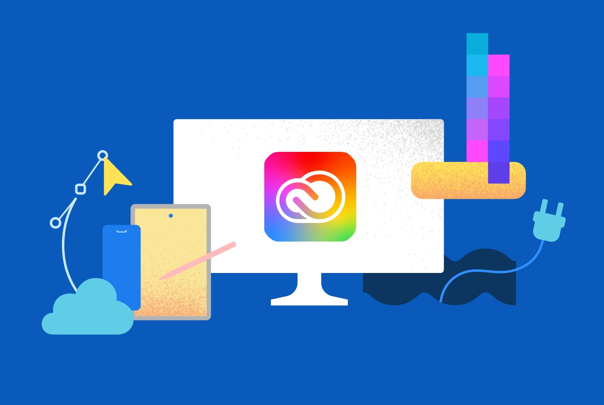

<Superhero slots="image, icon, heading, text, buttons" variant="halfWidth" />

:adobe:

# Adobe for creativity available in Claude

Adobe for creativity brings capabilities across the creative suite into a unified, creative connector. Access 50+ tools across Photoshop, Lightroom, Illustrator, Firefly, Premiere, Express, InDesign, and Adobe Stock — all through natural language, without switching apps. Describe what you want to achieve, from editing photos and vectors to designing assets and formatting video. Sign in with your Adobe account for higher usage limits, more tools, and cross-session continuity.

* [Try it in Claude](https://claude.ai/directory/connectors/adobe-creativity)

## Connector vs. Skills — what’s the difference and how to set them up

To get the full experience, you’ll set up two things:

### Connector

The connector links Claude to Adobe’s creative tools. Set it up once, and Claude can access and use those tools within your conversations.

[Use this link](https://claude.ai/directory/connectors/adobe-creativity) to connect directly or follow these instructions:

* Open **Claude** at claude.ai (or Claude Desktop) and sign in.
* In the left sidebar, click **Customize**.
* Select the **Connectors** tab, then click the + button.
* Click **Browse connectors**.
* Search for **Adobe for creativity** and click it.
* Click **Install** and confirm the connection.
* Sign in with your Adobe account to unlock higher usage limits, more tools, and work that saves across sessions. (You can skip this step and continue as a guest, but with reduced capabilities — see access tiers.)

### Skills (optional)

Skills guide how those tools are used for specific tasks. Think of them as ready-made workflows, like portrait retouching or designing from templates, with the right steps already built in.

Skills are available on GitHub. Download the skill files, then add them to Claude:

* Go to the Adobe skills [repository on GitHub](https://github.com/adobe/skills/tree/main/plugins/creative-cloud/adobe-for-creativity/skills).
* Download the skill file(s) you want to use.
* Open Claude and go to **Customize**.
* Select **Skills**.
* Click **Add skill** and upload the file.
* Confirm to install.

Once added, the connector and skills are available to use in your chats and will guide Claude through your workflows.

### How they work together

The connector gives you access and unlocks powerful capabilities on its own. Skills take it further by using the right tools to deliver results tailored to your workflow, making Claude noticeably better at specific creative tasks.

*Note: Connectors and skills can't be browsed or installed from the iOS or Android apps. Set up on the web or desktop first, then use the mobile apps to run the workflows you've installed.*

## What you can do with Adobe for creativity

These examples show what you can do with the connector and skills. You can start with these prompts and iterate to get the result you want.

| What you want to do | Try this |
| --- | --- |
| **Retouch portraits** | Drop in headshots and describe the look you want — balanced lighting, background blur, auto-straighten, and a portrait crop.  Prompt example: “Use portrait refinement to edit these headshots.” |
| **Design from template** | Describe your campaign and choose from design examples surfaced right in the conversation. Update text and colors and then animate.  Prompt example: “Make an Instagram story for my boutique sale from template library.” |
| **Resize videos for any platform** | Upload a horizontal clip and ask to reformat it for YouTube Shorts, Instagram Reels, or any platform.  Prompt example: “Resize this video for YouTube shorts.” |
| **Quick Cut your videos** | Turn longer videos into short, engaging clips — ideal for highlights, teasers, and social content.  Prompt example: “Create a 30-second highlight reel from this video.” |
| **Create social variations** | Turn one idea or asset into multiple social-ready versions with the right formats, copy, and visual treatments for each channel.  Prompt example: “Create social variations of this post for Instagram, LinkedIn, and TikTok.” |
| **Batch edit your photos** | Apply consistent adjustments across a set of images so they look polished and cohesive — ideal for mixed lighting, travel photos, or creating a unified style.  Prompt example: “Batch edit these photos — make them warm, consistent, and cinematic.” |

## What you need to get started

* A Claude account (Free, Pro, Max, Team, or Enterprise). Some features require a paid plan — see the [Getting started](./getting-started/index.md) page for details.
* An Adobe account for full functionality, higher limits, and saved work across sessions.
* Code execution and file creation enabled in Claude (required for skills):
  * Free, Pro, Max: Settings → Capabilities.
  * Team, Enterprise: An admin must enable Code execution, file creation, and Skills at the organization level.

## Available across Claude

The Adobe for creativity connector is available in three places: 

Because it's built on the Model Context Protocol (MCP), it works anywhere Claude runs: Claude chat (web and mobile), Claude Desktop and Cowork. 

### 🗨️ Claude chat (web & mobile)

Best for: quick conversational editst.

### 🖥️ Cowork (desktop)

### 💻 Claude Desktop

<InlineAlert slots="text" variant="info" />

Note: New connectors and skills can’t be browsed or installed from the iOS or Android apps. Set up on web or desktop first, then use the mobile apps to run the workflows you’ve installed.

→ [Full setup instructions for every surface](./getting-started/index.md)

## Continue in Adobe apps

Start in Claude, then take your work further in Adobe apps when you need more control. 

Batch edit photos and send them to Firefly Boards to organize and refine. Start a design from a template and continue in Express with full editing capabilities. Or download your assets and pick up where you left off in any Adobe app.

## Access details

Access scales with your Claude plan and your Adobe sign-in status.

|  | Guest (no Adobe sign-in) | Free Adobe account | Paid Adobe account (Creative Cloud, Firefly, etc.) |
| --- | --- | --- | --- |
| **Tools available** | ~40 standard tools | Expanded tool set (placeholder — confirm exact count) | All available tools |
| **Asset storage** | Session only | Saved to your Creative Cloud Files | Saved to your Creative Cloud Files |
| **Usage limits** | Lower | Higher | Highest |

## Get help

* Stuck on setup? Have a question? Or want to request a feature? See [FAQ & support](./support/index.md).
